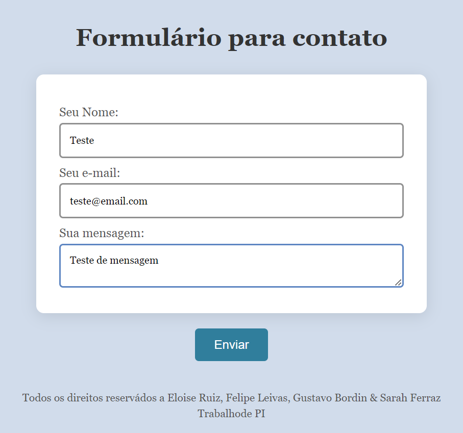
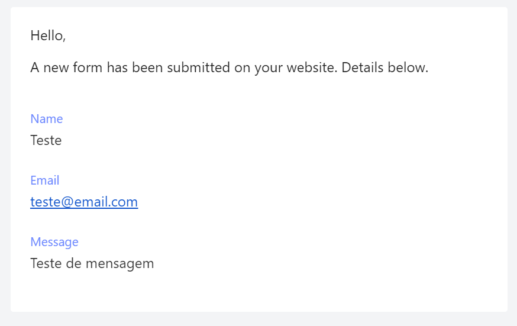

Para a execução deste trabalho usamos HTML, para estruturar os formuário com as inftomações para contato, e CSS, para fazer o front-end, deixandoo mais apresentável ao consumidor.

Ao preencher as informações de contado o cliente clica em enviar que manda as infromações para o e-mail do lider, Sarah Ferraz (sarahferraz005@gmail.com), isso é possivel por conta da estrutura:

 <form action="https://api.web3forms.com/submit" method="POST">
      <input
        type="hidden"
        name="access_key"
        value="1e6eebe2-63aa-4b3d-898a-6465bbb7bcb8"
      />

Nesta podemos observar o site: ="https://api.web3forms.com/submit" que ao se registra ele que garante que as infotmações ejam mandadas para o e-mail desejado.

Para garantir isso o site nos forneceu, após o cadastro, uma chave única: 1e6eebe2-63aa-4b3d-898a-6465bbb7bcb8, que é usada oara o envio das infromações por e-mail.

Já no CSS usamos class e outras especificações pra podermos deixar casa parte da experiencia do cliente mais agradavel.

 ->informações do cliente

 ->como as inftomações aparecem no e-mail
